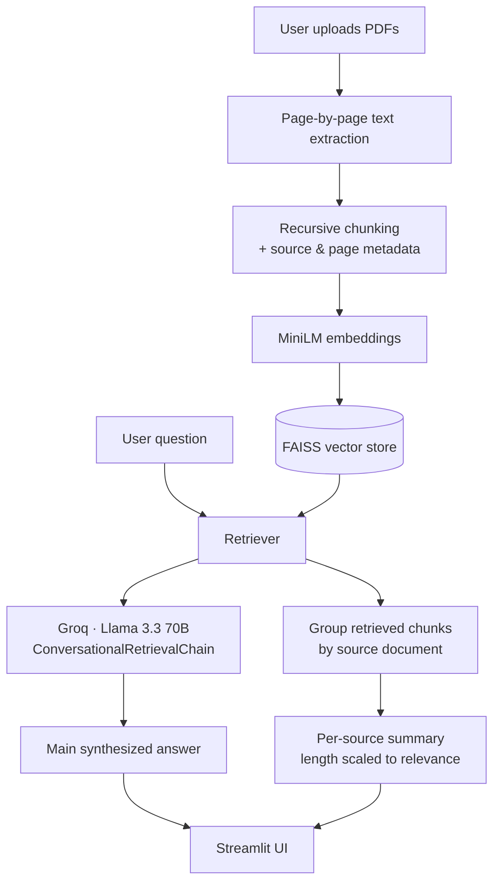

<div align="center">

# ContextAI

### Ask your documents anything. Actually trust the answer.

*A retrieval-augmented chatbot that doesn't just answer questions across multiple PDFs. It shows you exactly where each answer came from and helps you verify information without manually searching through documents.*

*Backed by an evaluation framework for measuring retrieval quality.*


</div>


## ⬥ Why this project exists

During my thesis, I'd open twenty tabs just to answer one question like *"What does this paper say about deep learning?"* — jumping between tabs, scrolling page by page, re-reading sections I'd already seen, and hunting for the paragraphs that contained the answers.

ContextAI is the tool I wished I had: upload your papers once, ask a question in plain language, and get a complete answer synthesized from relevant information across all your documents. Every answer is backed by the most relevant source passages and page references, allowing you to explore the original context in detail. 


## ⬥ Table of Contents

- [Key Features](#-key-features)
- [Architecture](#️-architecture)
- [Tech Stack](#️-tech-stack)
- [Evaluation](#-evaluation)
- [Engineering Journey](#-engineering-journey--problems-actually-solved)
- [Getting Started](#-getting-started)
- [Project Structure](#-project-structure)
- [Roadmap](#️-roadmap)
- [About](#-about)


## ⬥ Key Features

| Feature | What it actually does |
|---|---|
| **▸ Multi-PDF Ingestion** | Upload any number of PDFs; each is parsed and chunked independently. |
| **▸ Page-Level Source Attribution** | Every answer is followed by a breakdown of *which PDF, and which page* it drew from—not just a generated answer. |
| **▸ Cross-Document Synthesis** | Ask a question that spans multiple PDFs ("what do both papers agree on?") and get a genuinely synthesized answer, with each contributing source shown separately. |
| **▸ Relevance-Scaled Summaries** | A source with 2 relevant excerpts gets a 2-sentence summary; a source with 15 gets a full paragraph. Nothing important gets compressed into a throwaway line. |
| **▸ Document Coverage Transparency** | The interface shows how many of your uploaded documents actually contributed to *this specific* answer—an honesty signal most RAG demos skip. |
| **▸ Persistent Conversational Memory** | Follow-up questions ("who suffers from it?" after "what is aphantasia?") resolve correctly using chat history. |
| **▸ Evaluation Framework** | A standalone evaluation pipeline that scores the system's answers against a hand-verified question set. See [Evaluation](#-evaluation) below. |


## ⬥ Architecture



The key design decision is that retrieval happens only once. The retrieved chunks then feed two parallel paths: the main synthesized answer and a per-document breakdown grounded in those exact chunks. Nothing is pre-computed, ensuring every response is generated specifically for the current question.


## ⬥ Tech Stack

| Layer | Choice | Why |
|---|---|---|
| **UI** | Streamlit | Fast iteration, native chat components, custom CSS theming |
| **Orchestration** | LangChain (`langchain-classic` for legacy chains/memory) | `ConversationalRetrievalChain` + `ConversationBufferMemory` |
| **LLM** | Groq — Llama 3.3 70B Versatile | Fast inference with strong synthesis quality after replacing flan-t5-base, which struggled to generate coherent multi-sentence responses. |
| **Embeddings** | `sentence-transformers/all-MiniLM-L6-v2` | Lightweight, fast, solid semantic quality for this scale |
| **Vector store** | FAISS | Simple, in-memory, no external infrastructure required |
| **PDF parsing** | PyPDF2 | Page-level extraction (needed for citation metadata) |
| **Evaluation** | Custom LLM-as-judge harness (Groq) | See [Evaluation](#-evaluation) . |


## ⬥ Evaluation

Building a RAG system is one thing. Measuring how well it retrieves and reasons is another.

This repository includes a standalone evaluation pipeline that runs a hand-curated set of 15 questions through the complete RAG workflow and scores every generated answer using an LLM-as-judge methodology. The evaluation covers **10 single-document questions** and **5 cross-document reasoning questions**, measuring two complementary metrics:

- **Faithfulness** — Is the answer grounded in the retrieved source passages?
- **Relevance** — Does the answer correctly address the user's question?

> **Overall Performance**
>
> **Faithfulness:** 3.7 / 5  
> **Relevance:** 4.6 / 5

Because the evaluator uses the same model family (Llama 3.3 70B via Groq) as the system under test, these scores should be interpreted as a **relative quality signal rather than an absolute benchmark.**

| Category | Faithfulness | Relevance | Count |
|---|:---:|:---:|:---:|
| All questions | **3.7 / 5** | **4.6 / 5** | 15 |
| Single-document retrieval | **4.4 / 5** | **5.0 / 5** | 10 |
| Cross-document reasoning | **2.4 / 5** | **3.8 / 5** | 5 |

<details>
<summary><strong>Full per-question breakdown</strong> (click to expand)</summary>

| # | Question | Type | Faithfulness | Relevance |
|---|---|:---:|:---:|:---:|
| 1 | What is aphantasia and how does it affect people's experience of visual imagery? | Single | ⭐⭐⭐⭐⭐ | ⭐⭐⭐⭐⭐ |
| 2 | How did the researchers measure sensory imagery in people with aphantasia? | Single | ⭐⭐⭐⭐☆ | ⭐⭐⭐⭐⭐ |
| 3 | Why is the study of visual imagery important, and what are its implications? | Single | ⭐⭐⭐⭐☆ | ⭐⭐⭐⭐⭐ |
| 4 | How does the concept of aphantasia relate to the historical debate about the nature of visual imagery? | Single | ⭐⭐⭐☆☆ | ⭐⭐⭐⭐⭐ |
| 5 | What do the findings of this study suggest about the underlying neurological cause of aphantasia? | Single | ⭐⭐⭐⭐☆ | ⭐⭐⭐⭐⭐ |
| 6 | What is aphantasia and how does it affect individuals? | Single | ⭐⭐⭐⭐⭐ | ⭐⭐⭐⭐⭐ |
| 7 | Why is the study of aphantasia important for understanding visual cognition? | Single | ⭐⭐⭐⭐⭐ | ⭐⭐⭐⭐⭐ |
| 8 | How did the aphantasic individual perform on visual working memory trials vs. controls? | Single | ⭐⭐⭐⭐⭐ | ⭐⭐⭐⭐⭐ |
| 9 | What can be inferred about mental imagery's role in visual working memory? | Single | ⭐⭐⭐⭐☆ | ⭐⭐⭐⭐⭐ |
| 10 | How does the aphantasic individual's imagery-task performance compare to controls? | Single | ⭐⭐⭐⭐⭐ | ⭐⭐⭐⭐⭐ |
| 11 | What do both papers agree on regarding aphantasia? | Cross | ⭐⭐⭐⭐☆ | ⭐⭐⭐⭐☆ |
| 12 | How do the two studies investigate aphantasia differently? | Cross | ⭐⭐☆☆☆ | ⭐⭐⭐⭐☆ |
| 13 | What evidence from both papers supports aphantasia as a real phenomenon? | Cross | ⭐⭐☆☆☆ | ⭐⭐⭐⭐☆ |
| 14 | Which paper uses a larger/more diverse participant group, and why might that matter? | Cross | ⭐⭐☆☆☆ | ⭐⭐⭐⭐☆ |
| 15 | If someone read only one of these two papers, what would they be missing? | Cross | ⭐⭐☆☆☆ | ⭐⭐⭐☆☆ |

</details>

### Key Findings

The gap between single-document retrieval(4.4/5) and cross-document reasoning(2.4/5) faithfulness is not noise — it's a consistent, explainable pattern. Manual review of the low-scoring cross-document answers shows the model occasionally **fabricates specific figures or comparisons** (e.g. invented sample sizes) when when required to synthesize information across multiple retrieved sources, rather than simply report information from a single document. 

This is a well-known RAG failure mode, and identifying it—rather than stopping once the system produced plausible answers—is precisely why the evaluation framework was built.

### Next Steps

- Strengthen prompting for cross-document synthesis to encourage stricter grounding.
- Introduce a lightweight verification pass that checks multi-source answers against the retrieved chunks before returning them.
- Expand the evaluation dataset with additional documents and more diverse multi-hop reasoning questions.


## ⬥ Getting Started

```bash
# Clone the repository
git clone https://github.com/najifa-22/context-ai.git
cd ContextAI

# Create and activate a virtual environment
python -m venv venv
venv\Scripts\activate      # Windows
source venv/bin/activate   # macOS/Linux

# Install dependencies
pip install -r requirements.txt

# Create a `.env` file in the project root

# Add your Groq API key in `.env`
GROQ_API_KEY=your_api_key_here

# Run the application:
streamlit run app.py
```

### Running the Evaluation

```bash
# Generate a new evaluation question set (optional):
python generate_eval_set.py

# Evaluate the complete RAG pipeline:
python eval_score.py
```

> **Note:** On some Windows systems, local embedding generation may trigger a PyTorch/OpenMP native library conflict. If this occurs, run `eval_score.py` in a clean environment (e.g. Google Colab) instead of debugging Windows binary conflicts.


---


## ⬥ Project Structure

```
ContextAI/
├── app.py                  # Main Streamlit application
├── htmlTemplates.py        # Custom CSS + chat bubble templates
├── generate_eval_set.py    # LLM-generated Q&A pairs from source PDFs
├── eval_score.py           # Runs the eval set through the live pipeline + LLM-as-judge scoring
├── eval_set.json           # Curated evaluation questions (single-doc + cross-doc)
├── eval_report.md          # Generated evaluation summary (markdown, README-ready)
├── eval_results.json       # Raw per-question evaluation scores
├── requirements.txt
└── .env                    # GROQ_API_KEY (not committed)
```


## ⬥ Roadmap

-  Improve cross-document grounding to address the faithfulness gap identified during evaluation.
-  Add hybrid retrieval (FAISS + BM25).
-  Introduce cross-encoder reranking for more accurate retrieval.
-  Migrate from legacy LangChain chains to LCEL / LangGraph.
-  Support persistent vector stores (Chroma or Qdrant).


---
## Author

**Najifa Tasnim**

*Machine Learning • Retrieval-Augmented Generation • AI Applications*

*If you're a recruiter or professor reading this: the [Evaluation](#-evaluation) section is the part I'd point you to first.*

</div>

