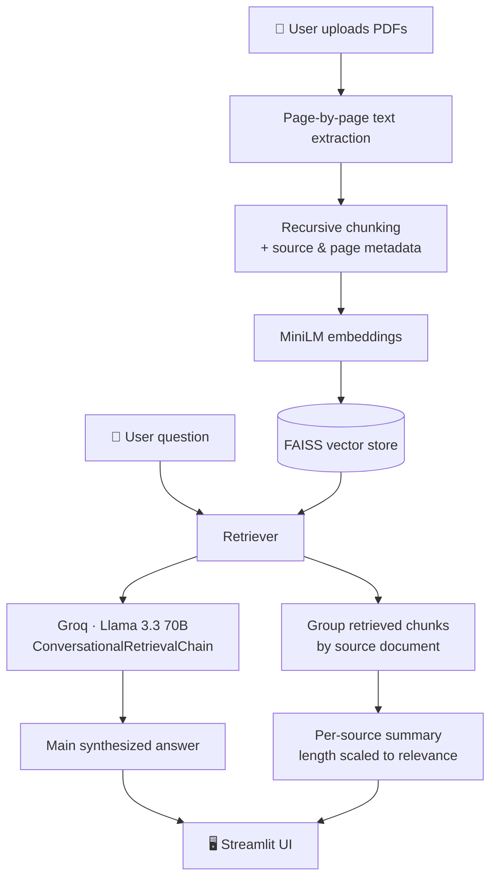

# ContextAI

ContextAI is an AI-powered system that allows users to upload multiple PDF files and ask questions in natural language. By combining semantic search, vector embeddings, and Retrieval-Augmented Generation (RAG), the system delivers context-aware answers based on the content of the uploaded documents. Built with LangChain, FAISS, Hugging Face models, and Streamlit, the project demonstrates the practical implementation of modern LLM technologies for intelligent document understanding and information retrieval.

## Features

* Upload multiple PDF documents
* Automatic text extraction
* Intelligent text chunking
* Semantic search using vector embeddings
* Conversational question answering
* Retrieval-Augmented Generation (RAG)

## Tech Stack

* Python
* Streamlit
* LangChain
* FAISS
* Hugging Face Transformers
* PyPDF2

## Project Workflow

1. Upload PDF documents
2. Extract text from PDFs
3. Split text into chunks
4. Generate embeddings
5. Store embeddings in FAISS vector database
6. Retrieve relevant document chunks
7. Generate answers using an LLM

## Installation

```bash
pip install -r requirements.txt
streamlit run app.py
```

## Future Improvements

* Source citations for retrieved document chunks
* Persistent chat history and conversation storage
* Support for additional document formats (DOCX, TXT, CSV)

<div align="center">

# 🧠 ContextAI

### Ask your documents anything — and actually trust the answer.

*A retrieval-augmented chatbot that doesn't just answer questions from your PDFs — it shows you exactly where each answer came from, and was rigorously evaluated to prove it.*


</div>

---

## 📌 Why this project exists

Most "chat with your PDF" projects stop at "it works." ContextAI started as one of those — and then got rebuilt around a harder question: **can I prove it works, and do I know exactly where it fails?**

That question is what separates the two halves of this README: a working multi-document RAG system, and a small but real evaluation study that found — and explains — a genuine weakness in it.

---

## 📖 Table of Contents

- [Key Features](#-key-features)
- [Architecture](#️-architecture)
- [Tech Stack](#️-tech-stack)
- [Evaluation](#-evaluation)
- [Engineering Journey](#-engineering-journey--problems-actually-solved)
- [Getting Started](#-getting-started)
- [Project Structure](#-project-structure)
- [Roadmap](#️-roadmap)
- [About](#-about)

---

## ✨ Key Features

| Feature | What it actually does |
|---|---|
| 📄 **Multi-PDF ingestion** | Upload any number of PDFs; each is parsed and chunked independently. |
| 🎯 **Page-level source attribution** | Every answer is followed by a breakdown of *which PDF, and which page* it drew from — not just "trust me." |
| 🔀 **Cross-document synthesis** | Ask a question that spans multiple PDFs ("what do both papers agree on?") and get a genuinely synthesized answer, with each contributing source shown separately. |
| 📏 **Relevance-scaled summaries** | A source with 2 relevant excerpts gets a 2-sentence summary; a source with 15 gets a full paragraph. Nothing important gets compressed into a throwaway line. |
| 🧾 **"X of Y PDFs relevant" transparency** | The UI tells you how many of your uploaded documents actually contributed to *this specific* answer — an honesty signal most RAG demos skip. |
| 🧵 **Persistent conversational memory** | Follow-up questions ("who suffers from it?" after "what is aphantasia?") resolve correctly using chat history. |
| 📊 **Built-in evaluation harness** | A standalone script that scores the system's own answers against a hand-verified question set — see [Evaluation](#-evaluation) below. |

---

## 🏗️ Architecture



The key design decision: retrieval happens **once**, and its results feed two parallel paths — the main synthesized answer, and a per-document breakdown grounded in exactly the chunks that were retrieved for *that* question. Nothing is a static, pre-computed summary.

---

## 🛠️ Tech Stack

| Layer | Choice | Why |
|---|---|---|
| **UI** | Streamlit | Fast iteration, native chat components, custom CSS theming |
| **Orchestration** | LangChain (`langchain-classic` for legacy chains/memory) | `ConversationalRetrievalChain` + `ConversationBufferMemory` |
| **LLM** | Groq — Llama 3.3 70B Versatile | Fast inference; strong synthesis quality after swapping off `flan-t5-base`, which was too weak for coherent multi-sentence answers |
| **Embeddings** | `sentence-transformers/all-MiniLM-L6-v2` | Lightweight, fast, solid semantic quality for this scale |
| **Vector store** | FAISS | Simple, in-memory, no external infra needed |
| **PDF parsing** | PyPDF2 | Page-level extraction (needed for citation metadata) |
| **Evaluation** | Custom LLM-as-judge harness (Groq) | See below |

---

## 📊 Evaluation

Anyone can *demo* a RAG app. Fewer people *measure* one. This project includes a standalone evaluation script (`eval_score.py`) that runs a hand-curated set of 15 questions — 10 single-document, 5 requiring synthesis across both source PDFs — through the live pipeline and scores every answer with an LLM-as-judge on **faithfulness** (is it actually grounded in the source?) and **relevance** (does it answer the question?).

> **Overall: 3.7/5 faithfulness · 4.6/5 relevance** across 15 questions (10 single-document, 5 cross-document).

Evaluated using an LLM-as-judge methodology (Llama 3.3 70B via Groq). Since the judge shares a model family with the system under test, scores should be read as a relative quality signal rather than an absolute benchmark.

| Category | Faithfulness | Relevance | Count |
|---|:---:|:---:|:---:|
| All questions | 3.7/5 | 4.6/5 | 15 |
| Single-document | **4.4/5** | **5.0/5** | 10 |
| Cross-document (multi-PDF reasoning) | **2.4/5** | 3.8/5 | 5 |

<details>
<summary><strong>Full per-question breakdown</strong> (click to expand)</summary>

| # | Question | Type | Faithfulness | Relevance |
|---|---|:---:|:---:|:---:|
| 1 | What is aphantasia and how does it affect people's experience of visual imagery? | Single-doc | ⭐⭐⭐⭐⭐ | ⭐⭐⭐⭐⭐ |
| 2 | How did the researchers measure sensory imagery in people with aphantasia? | Single-doc | ⭐⭐⭐⭐☆ | ⭐⭐⭐⭐⭐ |
| 3 | Why is the study of visual imagery important, and what are its implications? | Single-doc | ⭐⭐⭐⭐☆ | ⭐⭐⭐⭐⭐ |
| 4 | How does the concept of aphantasia relate to the historical debate about the nature of visual imagery? | Single-doc | ⭐⭐⭐☆☆ | ⭐⭐⭐⭐⭐ |
| 5 | What do the findings of this study suggest about the underlying neurological cause of aphantasia? | Single-doc | ⭐⭐⭐⭐☆ | ⭐⭐⭐⭐⭐ |
| 6 | What is aphantasia and how does it affect individuals? | Single-doc | ⭐⭐⭐⭐⭐ | ⭐⭐⭐⭐⭐ |
| 7 | Why is the study of aphantasia important for understanding visual cognition? | Single-doc | ⭐⭐⭐⭐⭐ | ⭐⭐⭐⭐⭐ |
| 8 | How did the aphantasic individual perform on visual working memory trials vs. controls? | Single-doc | ⭐⭐⭐⭐⭐ | ⭐⭐⭐⭐⭐ |
| 9 | What can be inferred about mental imagery's role in visual working memory? | Single-doc | ⭐⭐⭐⭐☆ | ⭐⭐⭐⭐⭐ |
| 10 | How does the aphantasic individual's imagery-task performance compare to controls? | Single-doc | ⭐⭐⭐⭐⭐ | ⭐⭐⭐⭐⭐ |
| 11 | What do both papers agree on regarding aphantasia? | Cross-doc | ⭐⭐⭐⭐☆ | ⭐⭐⭐⭐☆ |
| 12 | How do the two studies investigate aphantasia differently? | Cross-doc | ⭐⭐☆☆☆ | ⭐⭐⭐⭐☆ |
| 13 | What evidence from both papers supports aphantasia as a real phenomenon? | Cross-doc | ⭐⭐☆☆☆ | ⭐⭐⭐⭐☆ |
| 14 | Which paper uses a larger/more diverse participant group, and why might that matter? | Cross-doc | ⭐⭐☆☆☆ | ⭐⭐⭐⭐☆ |
| 15 | If someone read only one of these two papers, what would they be missing? | Cross-doc | ⭐⭐☆☆☆ | ⭐⭐⭐☆☆ |

</details>

### 🔍 What the evaluation actually found

The gap between single-document (4.4/5) and cross-document (2.4/5) faithfulness is not noise — it's a consistent, explainable pattern. Manual review of the low-scoring cross-document answers shows the model occasionally **fabricates specific figures or comparisons** (e.g. invented sample sizes) when it's under pressure to *synthesize* across two retrieved sets of chunks, rather than simply *report* from one. This is a well-known RAG failure mode, and finding it — rather than shipping a system that merely *looked* like it worked — is the actual point of building an evaluation harness in the first place.

**Next step to address it:** a stricter grounding prompt for cross-document questions, and/or a lightweight verification pass that checks multi-source answers against the retrieved chunks before returning them.

---

## 🔧 Engineering Journey — Problems Actually Solved

A running list of real issues hit and fixed during development — because "it works" hides all the interesting parts:

- **`ModuleNotFoundError: langchain.memory`** — the installed LangChain was actually v1.x despite a stale `requirements.txt` pinning 0.1.20; legacy memory/chains had moved to the separate `langchain-classic` package. Diagnosed via the *other* installed package versions, not just the error message.
- **`ValueError: Got multiple output keys`** — enabling `return_source_documents=True` broke `ConversationBufferMemory`'s ability to infer which output was "the answer"; fixed by setting `output_key='answer'` explicitly.
- **LLM quality bottleneck** — `google/flan-t5-base` produced single-word, non-sentence answers no matter how the prompt was tuned. Root cause was model capacity, not prompting — solved by swapping to Groq's Llama 3.3 70B.
- **Groq TPM rate limits (413 errors)** — free-tier token-per-minute caps were exceeded sending full PDF text per request; fixed by capping prompt input length per request.
- **Non-deterministic JSON output from the LLM** — structured generation (Q&A pair creation, judge scoring) occasionally returned malformed JSON; solved with a retry loop (up to 3 attempts) rather than crashing the whole batch on one bad response.
- **Windows `0xC0000005` access violation** — a native crash loading the embedding model locally, traced to a PyTorch/FAISS/OpenMP conflict common on Windows. After multiple mitigation attempts (env vars, thread limits, bypassing the LangChain wrapper), the reliable fix was moving the evaluation run to a clean Linux environment (Google Colab) rather than continuing to fight a Windows-specific binary conflict.
- **Stale `st.rerun()` UI state** — the Process button's label didn't update until an unrelated rerun occurred; fixed with an explicit session-state flag forcing a rerun immediately after processing completes.

---

## 🚀 Getting Started

```bash
# 1. Clone and enter the project
git clone <your-repo-url>
cd ContextAI

# 2. Create and activate a virtual environment
python -m venv venv
venv\Scripts\activate      # Windows
source venv/bin/activate   # macOS/Linux

# 3. Install dependencies
pip install -r requirements.txt

# 4. Add your Groq API key
echo GROQ_API_KEY=your-key-here > .env

# 5. Run the app
streamlit run app.py
```

### Running the evaluation suite

```bash
# (Optional) generate a fresh Q&A eval set from your own PDFs
python generate_eval_set.py

# Score the live pipeline against eval_set.json
python eval_score.py
```
> ⚠️ On Windows, local embedding generation may hit a PyTorch/OpenMP native crash. If it does, run `eval_score.py` in a clean environment (e.g. Google Colab) instead of debugging Windows binary conflicts.

---

## 📁 Project Structure

```
ContextAI/
├── app.py                  # Main Streamlit application
├── htmlTemplates.py        # Custom CSS + chat bubble templates
├── generate_eval_set.py    # LLM-generated Q&A pairs from source PDFs
├── eval_score.py           # Runs the eval set through the live pipeline + LLM-as-judge scoring
├── eval_set.json           # Curated evaluation questions (single-doc + cross-doc)
├── eval_report.md          # Generated evaluation summary (markdown, README-ready)
├── eval_results.json       # Raw per-question evaluation scores
├── requirements.txt
└── .env                    # GROQ_API_KEY (not committed)
```

---

## 🗺️ Roadmap

- [ ] Tighter grounding prompt for cross-document questions (directly targets the 2.4/5 faithfulness gap found in evaluation)
- [ ] Hybrid search (FAISS dense + BM25 sparse retrieval)
- [ ] Cross-encoder reranking on top of initial retrieval
- [ ] Migrate off deprecated `langchain-classic` chains to LCEL / LangGraph
- [ ] Persistent vector store (Chroma/Qdrant) instead of session-only FAISS

---

## 🎓 About

Built by a CSE graduate (2024) as a deep, evaluated exploration of retrieval-augmented generation — going beyond a working demo to measure, document, and honestly report where the system succeeds and where it doesn't.

---

<div align="center">

*If you're a recruiter or professor reading this: the [Evaluation](#-evaluation) section is the part I'd point you to first.*

</div>

